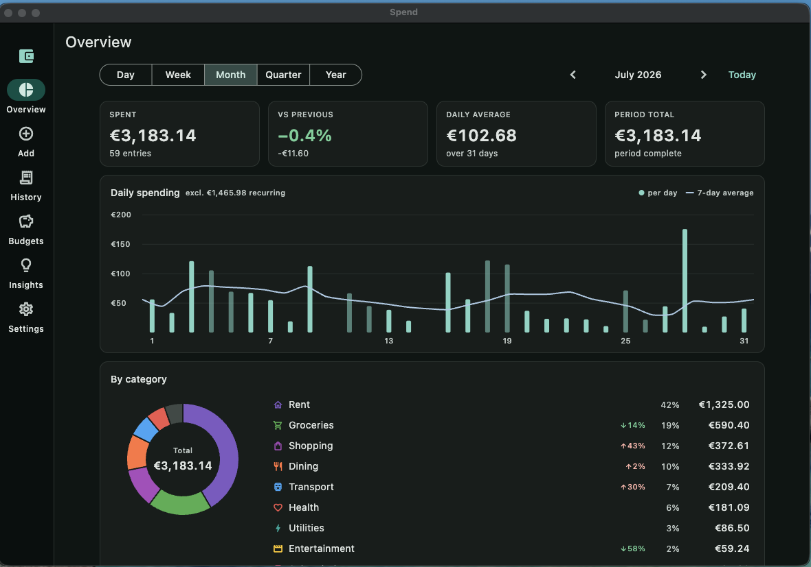
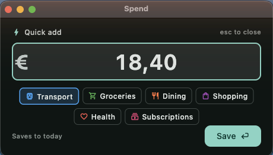
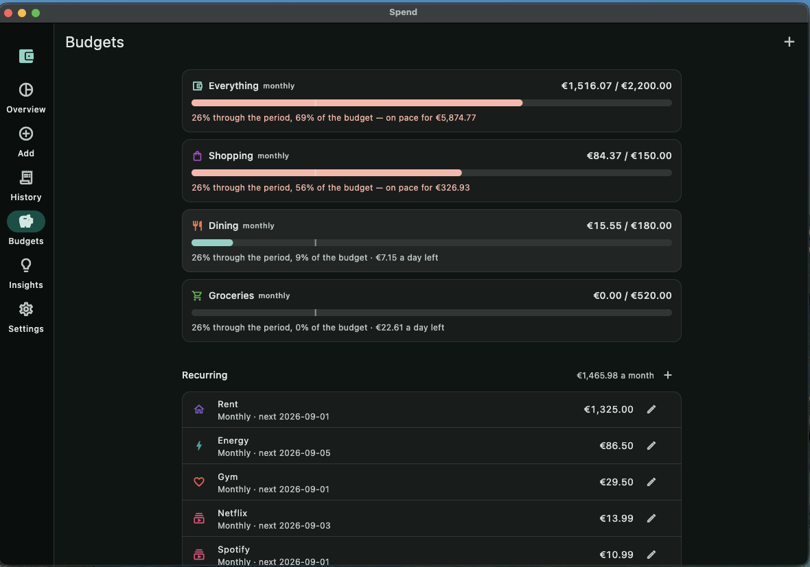
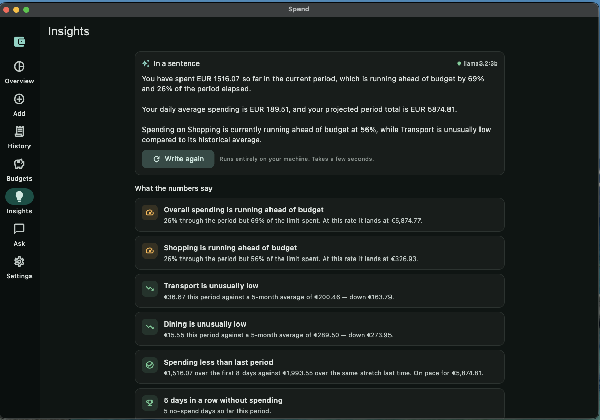
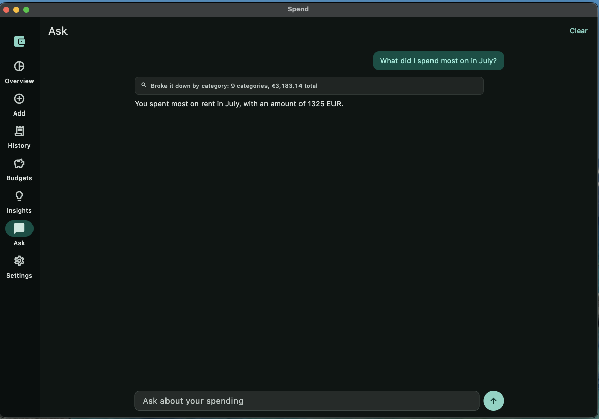
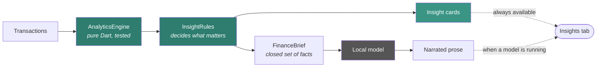
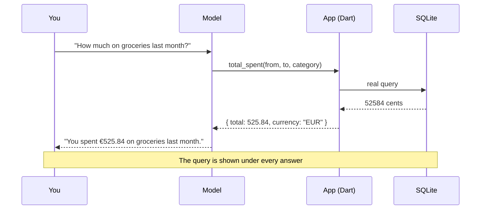
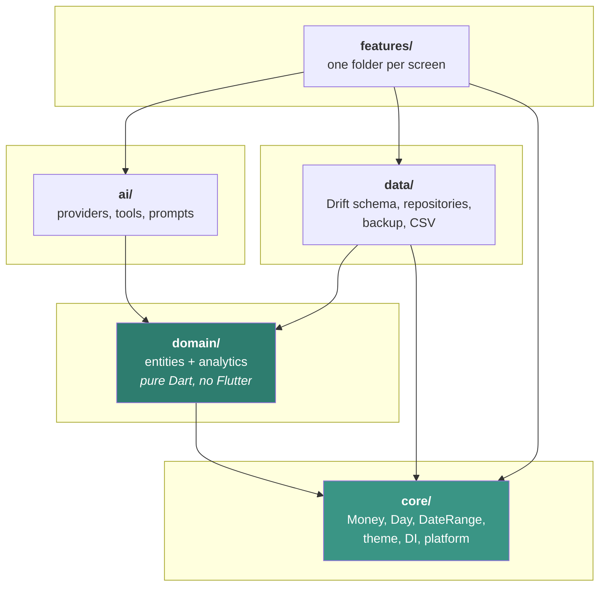

<div align="center">


# Spend

**A local-first daily expense tracker for macOS.**
No account, no server, no telemetry. Your ledger is a SQLite file on your own disk.

[](https://www.apple.com/macos/)
[](https://flutter.dev)
[](#testing)
[](LICENSE)



</div>

> [!NOTE]
> ### Built by Claude, as an experiment in AI-assisted development
>
> Every line of this repository — the app, the tests, this README — was written
> by **Claude Opus 5** (Anthropic) across a single working session. A human
> directed it: set the requirements, chose between the stacks on offer, decided
> the scope, and made the product calls.
>
> What made it interesting was not the code generation. It was that the AI ran
> the app, looked at its own output, and found bugs the tests had not caught —
> a chart made unreadable by one rent payment, an insight engine that flagged
> six categories at once because it averaged in months before the app existed, a
> capture panel that opened focused on nothing. Those are documented throughout,
> because they turned out to be the most instructive part.
>
> It is a working application, not a demo. But calibrate accordingly: it has one
> person's real-world use behind it, not a community's. Read the code before you
> trust it with your ledger — which is good advice for any finance app.

---

## Why this exists

Most expense trackers fail for one of two reasons. Either logging a €3.20 coffee
takes six taps and a login, so you stop doing it — or they want your bank
credentials in exchange for charts.

Spend takes the other route. Press **⌥⌘Space** anywhere on your Mac, type an
amount, hit Enter. That's the whole interaction. Everything else — charts,
budgets, insights — is computed from what you logged, on your machine, and
nothing ever leaves it.

## Features

|  |  |
|---|---|
| ⌨️ **Two-second capture** | A global shortcut opens a focused amount field from any app. Enter saves and it disappears. |
| 📊 **Honest charts** | Spend by category, daily trend with a 7-day average, period-over-period comparison that doesn't cheat. |
| 🎯 **Budgets with pacing** | Not "you've spent 70%" but "you're 58% through the month and 71% through the budget". |
| 🔁 **Recurring costs** | Rent and subscriptions are separated from discretionary spending, so the variable numbers mean something. |
| 💾 **Backup you can read** | One checksummed `.spendbak` file, plus rolling automatic snapshots. Plain JSON inside. |
| 📥 **Bank CSV import** | Column detection that copes with `YYYYMMDD` and semicolon delimiters, because that's what Dutch banks emit. |
| 🤖 **Optional local AI** | Narrated insights and a chat tab, powered by a model on your own machine. Entirely optional. |

<table>
<tr>
<td width="50%" align="center">

<br><sub><b>⌥⌘Space, anywhere.</b> Amount focused, categories ranked by recent use, today assumed.</sub>
</td>
<td width="50%" align="center">

<br><sub><b>Pacing, not just totals.</b> The tick marks how far through the period you are.</sub>
</td>
</tr>
<tr>
<td width="50%" align="center">

<br><sub><b>Computed observations.</b> Every card is arithmetic; the paragraph on top is optional.</sub>
</td>
<td width="50%" align="center">

<br><sub><b>Answers with receipts.</b> The query that produced the figure sits above it.</sub>
</td>
</tr>
</table>

## Two decisions that shape everything

Most of this codebase is ordinary. These two things are not, and they explain
most of the design.

### Money is an integer, always

Every amount is stored and computed as an `int` of minor units — cents. Never a
`double`.

```dart
0.1 + 0.2 == 0.30000000000000004   // the reason
```

Binary floating point cannot represent most decimal fractions. Sum a few
thousand transactions that way and the ledger quietly disagrees with itself.
Doubles appear exactly once in this app: at the moment of formatting for
display.

> There is a test that adds 10 cents a thousand times and asserts the result is
> exactly €100.00. It is not a joke test — it is the invariant the whole app
> rests on. → [`lib/core/money.dart`](lib/core/money.dart)

### Dates have no time and no timezone

A purchase happens on a **day**, not at an instant. Storing a `DateTime` invites
a whole class of bug where something logged late on the 31st lands in the next
month after a DST shift, silently moving money between reporting periods.

`Day` is year/month/day only, persisted as ISO `YYYY-MM-DD` text — which sorts
chronologically under plain lexical comparison and groups by month with
`substr(occurred_on, 1, 7)`. → [`lib/core/day.dart`](lib/core/day.dart)

## The AI never does arithmetic

The optional local model is deliberately kept away from anything numerical.



Every figure is computed in Dart first. The model receives already-computed
facts and rewrites them as sentences — it cannot hallucinate a total, because it
was never asked to produce one. **With no model installed you lose the phrasing
and keep all of the information.**

<details>
<summary><b>Three things learned from watching a 3B model narrate real data</b></summary>

Each of these is now handled at the data boundary rather than hoped away in the
prompt:

- **Units must be explicit.** Given `increase_minor: 10466`, the model wrote
  *"an increase in minor expenses of €10466"* — echoing the key name and
  overstating the figure a hundredfold. Keys ending `_minor` are converted to
  major units and renamed before the model sees them.
- **Time frames must be named.** Given only `spent_same_days_last_period`, it
  described the previous *month* as *"last year's same period"*. The comparison
  window now carries its literal dates.
- **Ratios must be percentages.** `10.476` became *"10.476 times"*. `1048`
  percent cannot be misread.

The insight rules also refuse to speak without evidence: a category needs at
least three months of real history before it can be called abnormal, because
averaging in the empty months before you started using the app makes ordinary
spending look extreme.

</details>

### Asking questions

The chat tab uses tool calling, for the same reason.



Five tools, no more — a small model picks correctly from five distinct options
far more often than from fifteen overlapping ones. If it asks for no tool at
all, the answer is discarded rather than guessed.

> **What this does and does not guarantee.** Every *figure* is real — the model
> copies values it was handed and never calculates. What it can still get wrong
> is a *comparative claim*. Asked what dominated a month, a 3B model answered
> correctly and then added "the others were all under 10%" when two were 19%
> and 12%. The prompt now forbids generalising about items it has not checked,
> but a small model will occasionally still over-reach. **That is exactly why
> the query sits above every answer.** Treat the prose as a summary and the
> evidence line as the truth.

## Quick start

**Requirements:** macOS 13+, [Flutter 3.44+](https://docs.flutter.dev/get-started/install/macos),
and Xcode with the command line tools.

```bash
git clone https://github.com/sepehrrezaei/spend.git
cd spend
flutter run -d macos
```

Building a standalone app:

```bash
flutter build macos --release
open build/macos/Build/Products/Release/
```

Signing is ad-hoc, so no paid Apple Developer account is needed to build and use
it on your own machine.

<details>
<summary><b>If <code>xcodebuild</code> can't find Xcode</b></summary>

`xcode-select` sometimes points at the Command Line Tools, which ship the macOS
SDK but not much else. Either fix it permanently:

```bash
sudo xcode-select -s /Applications/Xcode.app/Contents/Developer
```

or set it for one shell:

```bash
export DEVELOPER_DIR=/Applications/Xcode.app/Contents/Developer
```

</details>

## Optional: local AI

The Insights and Ask tabs light up when a local model is reachable. Nothing
leaves your machine and there is no API key.

```bash
docker compose up -d
docker compose exec ollama ollama pull llama3.2:3b
```

Stop it any time with `docker compose down` — the app simply falls back to its
computed cards.

> **A note on speed.** Docker Desktop on Apple Silicon runs a Linux VM with no
> Metal passthrough, so inference is CPU-only: measured at **7–19 tok/s**, which
> is roughly 10–30 seconds for an insight and 45–90 seconds for a chat answer
> (two model round trips). A native `brew install ollama` on the same port is a
> drop-in replacement and roughly halves that.

The port is bound to `127.0.0.1`, not `0.0.0.0`. Ollama has no authentication,
and the usual `-p 11434:11434` would expose a model server to everyone on your
network.

## Architecture



The rule that matters: **`domain/` imports nothing from Flutter.** That keeps the
money and date arithmetic testable from plain literals with no widget harness,
and it is why 77 of the tests run in milliseconds.

| Concern | Choice | Why |
|---|---|---|
| State | [Riverpod](https://riverpod.dev) | Compile-safe DI; overriding one provider redirects the whole graph in tests |
| Database | [Drift](https://drift.simonbinder.eu) | Typed SQL, reactive streams, real migrations |
| Charts | [fl_chart](https://pub.dev/packages/fl_chart) | Native rendering, no webview |
| Routing | [go_router](https://pub.dev/packages/go_router) | Declarative shell routing |
| Menu bar | tray / hotkey / window_manager | Desktop-only, behind a single capability guard |

Full detail in [`docs/ARCHITECTURE.md`](docs/ARCHITECTURE.md).

## Data model

```
categories       name, icon, colour, expense|income, archived
transactions     amount_minor INTEGER, category, occurred_on TEXT, note, merchant
budgets          per-category or overall caps, with effective dates
recurring_rules  rent, subscriptions, cadence, next due
app_settings     currency, theme, AI configuration
```

Two deliberate choices worth knowing:

- **Categories are archived, never deleted, once they have history.** The schema
  refuses a delete that would orphan transactions.
- **Editing a budget inserts a new row** rather than mutating the old one, so a
  completed month is still judged against the limit that actually applied then.

## Testing

```bash
flutter test
```

**237 tests**, concentrated where mistakes would be invisible in the UI:

| Area | Covers |
|---|---|
| `test/core` | Money precision, parsing both `12.40` and `12,40`, leap years, DST, month boundaries |
| `test/domain` | Period aggregation, partial-period comparison, budget pacing, insight rules |
| `test/data` | Schema round-trips, foreign-key enforcement, backup restore, CSV detection |
| `test/ai` | Tool argument repair, category resolution, refusing ambiguous matches |
| `test/widget` | Layout at phone and desktop widths, dialogs, the search box |
| `integration_test` | The real app on a real database file — see below |

Eight of them run end to end, in a real macOS app process rather than the
headless test harness:

```bash
flutter test -d macos integration_test
```

That is a different kind of coverage rather than more of the same. Every test
under `test/` runs with no plugins registered, so the database is always
in-memory and `path_provider` is stubbed. The end-to-end suite gets a real
SQLite file created by a real migration, real plugin channels, and real bytes on
disk — which is how a backup can be written, the ledger wiped, and the file
restored as an actual round trip. A stub Ollama on loopback covers the AI paths
without a model.

A few that exist because the bug actually happened:

- `1,2,3.4.5` must not parse as `€1234.50`
- A corrupt backup must leave the live database untouched
- Merging a backup from another machine must not duplicate categories
- A category with two months of history must not be called "unusually high"

## Contributing

Issues and pull requests are welcome — see [CONTRIBUTING.md](CONTRIBUTING.md).

The one hard rule: **no floating-point money, anywhere.** If a change makes a
`double` touch an amount before the formatting layer, it will be asked to change.

## Roadmap

- [ ] iOS and iPad (the codebase is structured for it; platform-specific code
      sits behind one capability guard, and the AI surfaces hide themselves
      where no local model can exist)
- [ ] Receipt attachments
- [ ] Multi-currency, which needs an offline FX story first

## Licence

[MIT](LICENSE) © Sepehr Rezaei
